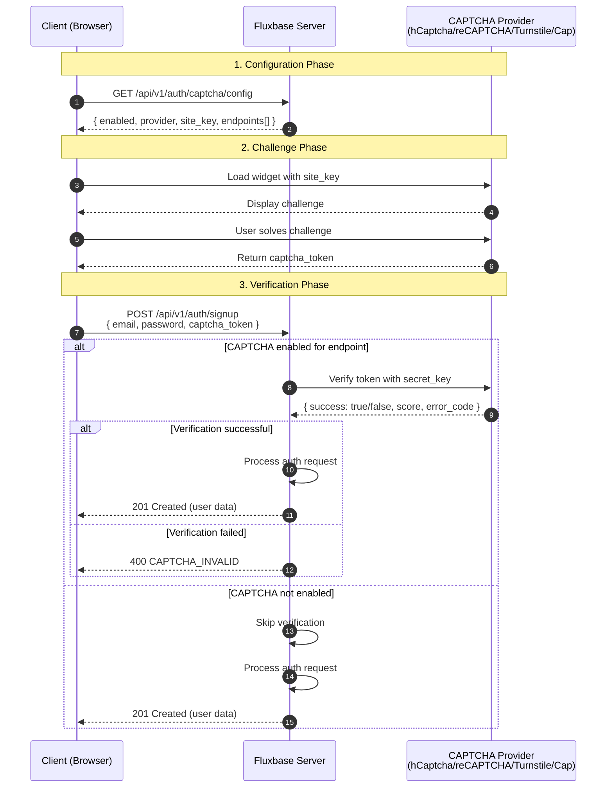
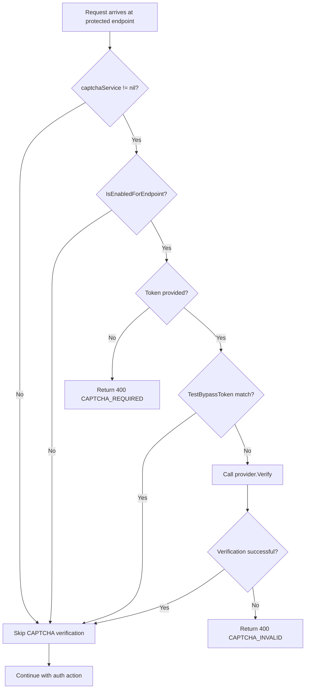
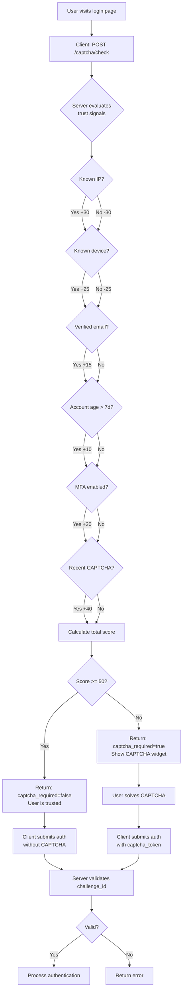
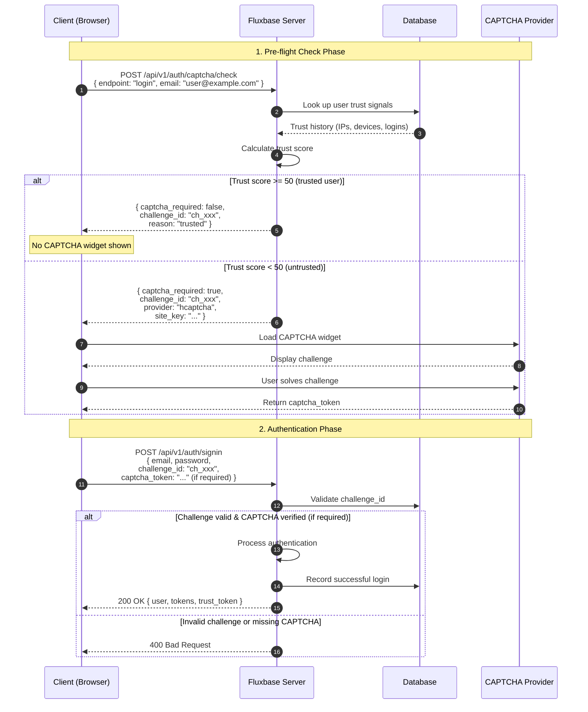
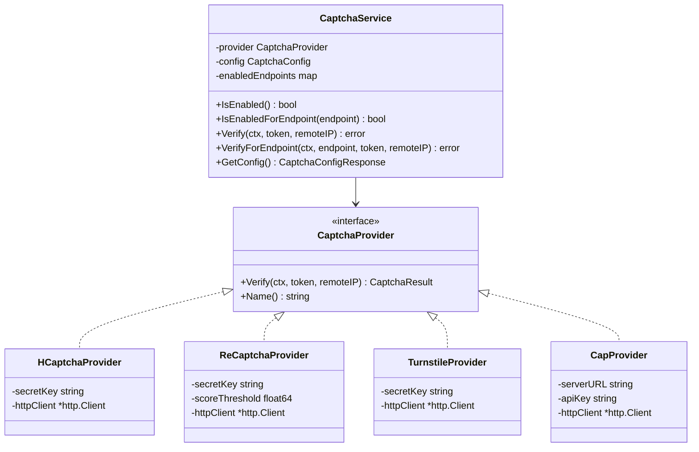

Fluxbase supports CAPTCHA verification to protect authentication endpoints from bots and automated abuse. Multiple providers are supported including hCaptcha, reCAPTCHA v3, Cloudflare Turnstile, and the self-hosted Cap provider.

## Overview

CAPTCHA protection can be enabled on specific authentication endpoints:

- **signup** - New user registration
- **login** - User authentication
- **password_reset** - Password reset requests
- **magic_link** - Magic link authentication

When enabled, clients must include a valid CAPTCHA token with their authentication requests.

## How It Works

The CAPTCHA verification flow involves three parties: the client (browser), the Fluxbase server, and the CAPTCHA provider.

### Verification Flow



### Server-Side Decision Flow



### Key Points

1. **Client fetches config first** - The client calls `/api/v1/auth/captcha/config` to know which provider and endpoints require CAPTCHA
2. **Widget generates token** - The CAPTCHA widget (hCaptcha, reCAPTCHA, etc.) generates a one-time token when the user completes the challenge
3. **Token included in request** - The client includes `captcha_token` in the request body to protected endpoints
4. **Server-side verification** - Fluxbase verifies the token with the provider's API using the secret key
5. **Endpoint-specific** - CAPTCHA is only required for endpoints listed in the `endpoints` configuration

## Adaptive Trust System

The Adaptive Trust system intelligently determines whether CAPTCHA is needed based on user trust signals. This provides a better user experience for returning users while maintaining security.

### How Adaptive Trust Works



### Trust Signal Weights

| Signal | Weight | Description |
|--------|--------|-------------|
| Known IP address | +30 | User has logged in from this IP before |
| Known device | +25 | Device fingerprint recognized |
| Recent CAPTCHA | +40 | Solved CAPTCHA in last 15 minutes |
| Verified email | +15 | Email address is confirmed |
| Account age > 7 days | +10 | Account is not brand new |
| 3+ successful logins | +10 | History of successful logins |
| MFA enabled | +20 | User has 2FA configured |
| New IP address | -30 | Never seen this IP for this user |
| New device | -25 | Unknown device fingerprint |
| Failed attempts | -20 | Recent failed login attempts |

**Threshold**: A score below **50** requires CAPTCHA verification.

### Pre-flight Check Flow



### Example: Trust Score Calculation

**Scenario 1: Returning user, same device**
```
Known IP:           +30
Known device:       +25
Verified email:     +15
Account age > 7d:   +10
MFA enabled:        +20
────────────────────────
Total:              100  ✓ No CAPTCHA needed
```

**Scenario 2: New user signup**
```
No account:         -30
New device:         -25
────────────────────────
Total:              -55  ✗ CAPTCHA required
```

**Scenario 3: Returning user, new IP (traveling)**
```
NEW IP:             -30
Known device:       +25
Verified email:     +15
Account age > 7d:   +10
MFA enabled:        +20
────────────────────────
Total:               40  ✗ CAPTCHA required
```

### Adaptive Trust Configuration

```yaml
security:
  captcha:
    enabled: true
    provider: hcaptcha
    site_key: "your-site-key"
    secret_key: "your-secret-key"
    endpoints:
      - signup
      - login
      - password_reset
      - magic_link

    # Enable adaptive trust for intelligent CAPTCHA decisions
    adaptive_trust:
      enabled: true

      # Trust token settings
      trust_token_ttl: "15m"      # CAPTCHA solution trusted for 15 minutes
      trust_token_bound_ip: true  # Token only valid from same IP

      # Challenge settings
      challenge_expiry: "5m"      # Challenge valid for 5 minutes

      # Trust threshold (score below this requires CAPTCHA)
      captcha_threshold: 50

      # Custom trust signal weights (optional)
      weight_known_ip: 30
      weight_known_device: 25
      weight_recent_captcha: 40
      weight_verified_email: 15
      weight_account_age: 10
      weight_successful_logins: 10
      weight_mfa_enabled: 20
      weight_new_ip: -30
      weight_new_device: -25
      weight_failed_attempts: -20

      # Endpoints that always require CAPTCHA (regardless of trust)
      always_require_endpoints:
        - password_reset
```

### SDK Usage with Adaptive Trust

```typescript
import { FluxbaseClient } from "@fluxbase/sdk";

const client = new FluxbaseClient({ url: "http://localhost:8080" });

// Step 1: Check if CAPTCHA is required
const { data: check } = await client.auth.checkCaptcha({
  endpoint: "login",
  email: "user@example.com",
  deviceFingerprint: getDeviceFingerprint(), // Optional
});

// Step 2: Show CAPTCHA only if required
let captchaToken: string | undefined;

if (check?.captcha_required) {
  // Show CAPTCHA widget and get token
  captchaToken = await showCaptchaWidget(check.provider, check.site_key);
}

// Step 3: Sign in with challenge_id (always) and captcha_token (if required)
const { data, error } = await client.auth.signIn({
  email: "user@example.com",
  password: "SecurePassword123",
  challengeId: check?.challenge_id,
  captchaToken, // Only if CAPTCHA was required
  deviceFingerprint: getDeviceFingerprint(), // Optional, for trust tracking
});

// The response includes a trust_token if CAPTCHA was verified
// Store it for future requests to skip CAPTCHA
if (data?.trust_token) {
  localStorage.setItem("fluxbase_trust_token", data.trust_token);
}
```

### Using Trust Tokens

After solving a CAPTCHA, the server issues a trust token that can be used to skip CAPTCHA for subsequent requests within the TTL window:

```typescript
// On next login attempt, include the trust token
const trustToken = localStorage.getItem("fluxbase_trust_token");

const { data: check } = await client.auth.checkCaptcha({
  endpoint: "login",
  email: "user@example.com",
  trustToken, // Include previous trust token
});

// If trust token is valid, captcha_required will be false
console.log(check?.captcha_required); // false
console.log(check?.reason); // "valid_trust_token"
```

### REST API for Adaptive Trust

**Check CAPTCHA requirement:**

```bash
POST /api/v1/auth/captcha/check
Content-Type: application/json

{
  "endpoint": "login",
  "email": "user@example.com",
  "device_fingerprint": "abc123",
  "trust_token": "tt_previous_token"
}
```

**Response (trusted user):**
```json
{
  "captcha_required": false,
  "reason": "trusted",
  "trust_score": 85,
  "challenge_id": "ch_abc123def456",
  "expires_at": "2024-01-15T10:05:00Z"
}
```

**Response (untrusted user):**
```json
{
  "captcha_required": true,
  "reason": "new_ip_address",
  "trust_score": 35,
  "provider": "hcaptcha",
  "site_key": "10000000-ffff-ffff-ffff-000000000001",
  "challenge_id": "ch_abc123def456",
  "expires_at": "2024-01-15T10:05:00Z"
}
```

**Sign in with challenge:**
```bash
POST /api/v1/auth/signin
Content-Type: application/json

{
  "email": "user@example.com",
  "password": "SecurePassword123",
  "challenge_id": "ch_abc123def456",
  "captcha_token": "token-from-widget",
  "device_fingerprint": "abc123"
}
```

### Error Codes

| Code | Description |
|------|-------------|
| `CAPTCHA_REQUIRED` | CAPTCHA token missing but required |
| `CAPTCHA_INVALID` | CAPTCHA verification failed |
| `CHALLENGE_EXPIRED` | Challenge ID has expired (>5 min) |
| `CHALLENGE_CONSUMED` | Challenge ID already used |
| `CHALLENGE_INVALID` | Challenge ID not found or context mismatch |

## Supported Providers

| Provider                                                               | Type                    | Self-Hosted | Best For                     |
| ---------------------------------------------------------------------- | ----------------------- | ----------- | ---------------------------- |
| [hCaptcha](https://www.hcaptcha.com/)                                  | Visual challenge        | No          | Privacy-focused applications |
| [reCAPTCHA v3](https://www.google.com/recaptcha/)                      | Invisible (score-based) | No          | Seamless user experience     |
| [Cloudflare Turnstile](https://www.cloudflare.com/products/turnstile/) | Invisible               | No          | Cloudflare users, free tier  |
| [Cap](https://capjs.js.org/)                                           | Proof-of-work           | Yes         | Self-hosted, privacy-first   |

## Configuration

### YAML Configuration

```yaml
security:
  captcha:
    enabled: true
    provider: hcaptcha # hcaptcha, recaptcha_v3, turnstile, cap
    site_key: "your-site-key"
    secret_key: "your-secret-key"
    score_threshold: 0.5 # reCAPTCHA v3 only (0.0-1.0)
    endpoints:
      - signup
      - login
      - password_reset
      - magic_link
```

### Environment Variables

| Variable                                    | Description                                  |
| ------------------------------------------- | -------------------------------------------- |
| `FLUXBASE_SECURITY_CAPTCHA_ENABLED`         | Enable CAPTCHA verification (`true`/`false`) |
| `FLUXBASE_SECURITY_CAPTCHA_PROVIDER`        | Provider name                                |
| `FLUXBASE_SECURITY_CAPTCHA_SITE_KEY`        | Public site key                              |
| `FLUXBASE_SECURITY_CAPTCHA_SECRET_KEY`      | Secret key for verification                  |
| `FLUXBASE_SECURITY_CAPTCHA_SCORE_THRESHOLD` | Score threshold (reCAPTCHA v3 only)          |
| `FLUXBASE_SECURITY_CAPTCHA_ENDPOINTS`       | Comma-separated list of endpoints            |

### Cap Provider Configuration

For the self-hosted Cap provider, use different configuration options:

```yaml
security:
  captcha:
    enabled: true
    provider: cap
    cap_server_url: "http://localhost:3000" # Your Cap server URL
    cap_api_key: "your-api-key"
    endpoints:
      - signup
      - login
```

| Variable                                   | Description            |
| ------------------------------------------ | ---------------------- |
| `FLUXBASE_SECURITY_CAPTCHA_CAP_SERVER_URL` | URL of your Cap server |
| `FLUXBASE_SECURITY_CAPTCHA_CAP_API_KEY`    | Cap API key            |

## Provider Setup

### hCaptcha

1. Sign up at [hcaptcha.com](https://www.hcaptcha.com/)
2. Add your domain to get your site key and secret key
3. Configure Fluxbase:

```yaml
security:
  captcha:
    enabled: true
    provider: hcaptcha
    site_key: "10000000-ffff-ffff-ffff-000000000001" # Test key
    secret_key: "0x0000000000000000000000000000000000000000" # Test key
```

### reCAPTCHA v3

1. Register at [Google reCAPTCHA](https://www.google.com/recaptcha/admin)
2. Select reCAPTCHA v3 and add your domains
3. Configure with your keys:

```yaml
security:
  captcha:
    enabled: true
    provider: recaptcha_v3
    site_key: "your-recaptcha-site-key"
    secret_key: "your-recaptcha-secret-key"
    score_threshold: 0.5 # Reject scores below this (0.0 = bot, 1.0 = human)
```

### Cloudflare Turnstile

1. Access [Cloudflare Turnstile](https://dash.cloudflare.com/?to=/:account/turnstile) dashboard
2. Create a widget for your domain
3. Configure Fluxbase:

```yaml
security:
  captcha:
    enabled: true
    provider: turnstile
    site_key: "your-turnstile-site-key"
    secret_key: "your-turnstile-secret-key"
```

### Cap (Self-Hosted)

Cap is a proof-of-work CAPTCHA that runs entirely on your infrastructure.

1. Run the Cap server:

```bash
docker run -p 3000:3000 ghcr.io/tiagozip/cap:latest
```

2. Configure Fluxbase:

```yaml
security:
  captcha:
    enabled: true
    provider: cap
    cap_server_url: "http://localhost:3000"
    cap_api_key: "your-api-key"
```

## Frontend Integration

### Getting CAPTCHA Configuration

First, fetch the CAPTCHA configuration from your Fluxbase server:

```typescript
const response = await fetch(
  "http://localhost:8080/api/v1/auth/captcha/config",
);
const config = await response.json();

// {
//   "enabled": true,
//   "provider": "hcaptcha",
//   "site_key": "your-site-key",
//   "endpoints": ["signup", "login"]
// }
```

### hCaptcha Widget

```html
<script src="https://js.hcaptcha.com/1/api.js" async defer></script>

<form id="signup-form">
  <input type="email" name="email" required />
  <input type="password" name="password" required />
  <div class="h-captcha" data-sitekey="YOUR_SITE_KEY"></div>
  <button type="submit">Sign Up</button>
</form>

<script>
  document.getElementById("signup-form").onsubmit = async (e) => {
    e.preventDefault();
    const token = hcaptcha.getResponse();

    await fetch("/api/v1/auth/signup", {
      method: "POST",
      headers: { "Content-Type": "application/json" },
      body: JSON.stringify({
        email: e.target.email.value,
        password: e.target.password.value,
        captcha_token: token,
      }),
    });
  };
</script>
```

### reCAPTCHA v3 Widget

```html
<script src="https://www.google.com/recaptcha/api.js?render=YOUR_SITE_KEY"></script>

<script>
  async function signUp(email, password) {
    const token = await grecaptcha.execute("YOUR_SITE_KEY", {
      action: "signup",
    });

    await fetch("/api/v1/auth/signup", {
      method: "POST",
      headers: { "Content-Type": "application/json" },
      body: JSON.stringify({
        email,
        password,
        captcha_token: token,
      }),
    });
  }
</script>
```

### Cloudflare Turnstile Widget

```html
<script
  src="https://challenges.cloudflare.com/turnstile/v0/api.js"
  async
  defer
></script>

<form id="signup-form">
  <input type="email" name="email" required />
  <input type="password" name="password" required />
  <div class="cf-turnstile" data-sitekey="YOUR_SITE_KEY"></div>
  <button type="submit">Sign Up</button>
</form>

<script>
  document.getElementById("signup-form").onsubmit = async (e) => {
    e.preventDefault();
    const token = document.querySelector(
      '[name="cf-turnstile-response"]',
    ).value;

    await fetch("/api/v1/auth/signup", {
      method: "POST",
      headers: { "Content-Type": "application/json" },
      body: JSON.stringify({
        email: e.target.email.value,
        password: e.target.password.value,
        captcha_token: token,
      }),
    });
  };
</script>
```

### Cap Widget

```html
<!-- Load Cap widget from your self-hosted server -->
<script src="http://localhost:3000/widget.js"></script>

<form id="signup-form">
  <input type="email" name="email" required />
  <input type="password" name="password" required />
  <cap-widget data-cap-url="http://localhost:3000"></cap-widget>
  <input type="hidden" name="captcha_token" id="captcha_token" />
  <button type="submit">Sign Up</button>
</form>

<script>
  // Cap widget will populate the token when solved
  window.onCapComplete = (token) => {
    document.getElementById("captcha_token").value = token;
  };
</script>
```

## SDK Usage

### TypeScript SDK

```typescript
import { FluxbaseClient } from "@fluxbase/sdk";

const client = new FluxbaseClient({ url: "http://localhost:8080" });

// Get CAPTCHA configuration
const { data: config } = await client.auth.getCaptchaConfig();

if (config?.enabled) {
  console.log("CAPTCHA provider:", config.provider);
  console.log("Site key:", config.site_key);
  console.log("Protected endpoints:", config.endpoints);
}

// Sign up with CAPTCHA token
const { data, error } = await client.auth.signUp({
  email: "user@example.com",
  password: "SecurePassword123",
  captchaToken: "token-from-widget",
});

// Sign in with CAPTCHA token
const { data: session, error } = await client.auth.signIn({
  email: "user@example.com",
  password: "SecurePassword123",
  captchaToken: "token-from-widget",
});

// Request password reset with CAPTCHA
await client.auth.resetPassword({
  email: "user@example.com",
  captchaToken: "token-from-widget",
});
```

### React SDK

```tsx
import {
  useCaptchaConfig,
  useCaptcha,
  useSignUp,
  isCaptchaRequiredForEndpoint,
} from "@fluxbase/sdk-react";

function SignUpForm() {
  const { data: config } = useCaptchaConfig();
  const captcha = useCaptcha(config?.provider);
  const signUp = useSignUp();

  const handleSubmit = async (e: React.FormEvent) => {
    e.preventDefault();

    let captchaToken: string | undefined;

    // Check if CAPTCHA is required for signup
    if (isCaptchaRequiredForEndpoint(config, "signup")) {
      captchaToken = await captcha.execute();
    }

    await signUp.mutateAsync({
      email,
      password,
      captchaToken,
    });
  };

  return (
    <form onSubmit={handleSubmit}>
      <input type="email" name="email" required />
      <input type="password" name="password" required />

      {config?.enabled && config.provider && (
        <CaptchaWidget
          provider={config.provider}
          siteKey={config.site_key}
          onVerify={captcha.setToken}
        />
      )}

      <button type="submit" disabled={signUp.isPending}>
        Sign Up
      </button>
    </form>
  );
}
```

### useCaptcha Hook

The `useCaptcha` hook provides a unified interface for all CAPTCHA providers:

```tsx
const captcha = useCaptcha(provider);

// Properties
captcha.token; // Current token (string | null)
captcha.isReady; // Widget loaded and ready (boolean)
captcha.isLoading; // Widget is loading (boolean)
captcha.error; // Any error during loading (Error | null)

// Methods
captcha.execute(); // Execute CAPTCHA and get token (Promise<string>)
captcha.reset(); // Reset the widget
captcha.setToken(); // Manually set token (for widget callbacks)
```

## REST API

### Get CAPTCHA Configuration

```bash
GET /api/v1/auth/captcha/config
```

Returns the public CAPTCHA configuration:

```json
{
  "enabled": true,
  "provider": "hcaptcha",
  "site_key": "10000000-ffff-ffff-ffff-000000000001",
  "endpoints": ["signup", "login", "password_reset", "magic_link"]
}
```

### Protected Endpoints

When CAPTCHA is enabled for an endpoint, include the token in your request:

```bash
# Sign up with CAPTCHA
curl -X POST http://localhost:8080/api/v1/auth/signup \
  -H "Content-Type: application/json" \
  -d '{
    "email": "user@example.com",
    "password": "SecurePassword123",
    "captcha_token": "10000000-aaaa-bbbb-cccc-000000000001"
  }'

# Sign in with CAPTCHA
curl -X POST http://localhost:8080/api/v1/auth/login \
  -H "Content-Type: application/json" \
  -d '{
    "email": "user@example.com",
    "password": "SecurePassword123",
    "captcha_token": "10000000-aaaa-bbbb-cccc-000000000001"
  }'
```

### Error Responses

| Status | Error                   | Description                           |
| ------ | ----------------------- | ------------------------------------- |
| 400    | `captcha_required`      | CAPTCHA token is required but missing |
| 400    | `captcha_invalid`       | CAPTCHA verification failed           |
| 400    | `captcha_expired`       | CAPTCHA token has expired             |
| 400    | `captcha_score_too_low` | reCAPTCHA v3 score below threshold    |

## Troubleshooting

### CAPTCHA verification always fails

1. **Check your keys** - Ensure site key and secret key match and are for the correct environment (test vs production)
2. **Domain mismatch** - Verify your domain is registered with the CAPTCHA provider
3. **Clock skew** - Ensure server time is synchronized (tokens expire)

### reCAPTCHA v3 scores are too low

- Adjust `score_threshold` lower (e.g., 0.3 instead of 0.5)
- reCAPTCHA v3 learns over time; scores improve with traffic
- Consider using action names that match your endpoint (`signup`, `login`)

### Cap widget not loading

- Verify Cap server is running and accessible
- Check browser console for CORS errors
- Ensure `cap_server_url` matches your Cap server exactly

### CAPTCHA not showing on frontend

```typescript
// Always check if CAPTCHA is required before rendering
const { data: config } = await client.auth.getCaptchaConfig();

if (config?.enabled && config.endpoints?.includes("signup")) {
  // Render CAPTCHA widget
}
```

## Security Best Practices

1. **Never expose secret keys** - Secret keys should only be on the server
2. **Use HTTPS** - CAPTCHA tokens should be transmitted over HTTPS
3. **Combine with rate limiting** - CAPTCHA doesn't replace rate limiting
4. **Monitor verification failures** - High failure rates may indicate attacks
5. **Token single-use** - Each token should only be used once

## Architecture

The CAPTCHA system is implemented with a clean provider abstraction:



### Key Implementation Files

| File                                 | Description                                                 |
| ------------------------------------ | ----------------------------------------------------------- |
| `internal/auth/captcha.go`           | Main CaptchaService, provider interface, verification logic |
| `internal/auth/captcha_hcaptcha.go`  | hCaptcha provider implementation                            |
| `internal/auth/captcha_recaptcha.go` | reCAPTCHA v3 provider with score threshold                  |
| `internal/auth/captcha_turnstile.go` | Cloudflare Turnstile provider                               |
| `internal/auth/captcha_cap.go`       | Self-hosted Cap provider with SSRF protection               |
| `internal/api/auth_handler.go`       | Auth endpoint handlers with CAPTCHA verification            |
| `internal/config/config.go`          | CAPTCHA configuration structures                            |

## Next Steps

- [Authentication](/guides/authentication) - Authentication overview
- [Rate Limiting](/guides/rate-limiting) - Rate limiting configuration
- [Row-Level Security](/guides/row-level-security) - Data access control
