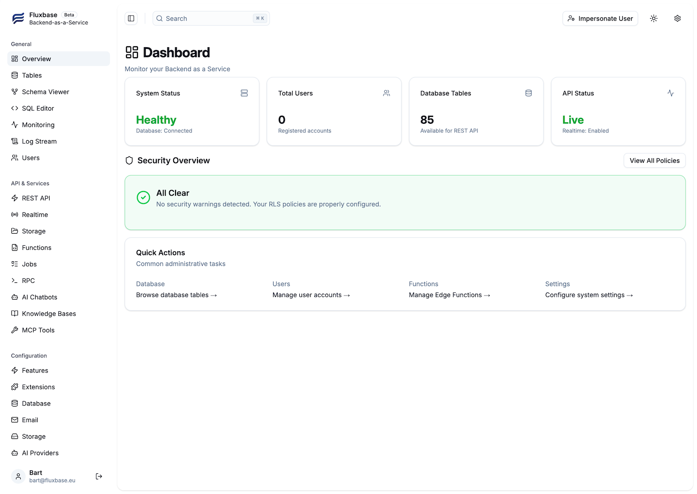

import { Card, CardGrid, LinkCard } from "@astrojs/starlight/components";

<div class="tech-badges">
  <span class="tech-badge">Go 1.25+</span>
  <span class="tech-badge">PostgreSQL 17</span>
  <span class="tech-badge">Deno Runtime</span>
  <span class="tech-badge">TypeScript SDK</span>
  <span class="tech-badge">React Hooks</span>
  <span class="tech-badge">Single Binary</span>
</div>

:::caution[Beta Software]
Fluxbase is currently in beta. While the core features are stable, you may encounter breaking changes between versions. We welcome feedback and contributions!
:::

<div class="section-divider"></div>

## Core Features

<div class="features-grid-enhanced">
  <div class="feature-card-enhanced">
    <div class="icon-wrapper">🗄️</div>
    <h3>PostgreSQL Database</h3>
    <p>Full PostgreSQL with PostgREST-compatible API, row-level security, and automatic migrations.</p>
  </div>

<div class="feature-card-enhanced">
  <div class="icon-wrapper">🔐</div>
  <h3>Authentication</h3>
  <p>
    JWT tokens, OAuth/OIDC, SAML SSO, magic links, 2FA, and complete user
    management.
  </p>
</div>

<div class="feature-card-enhanced">
  <div class="icon-wrapper">⚡</div>
  <h3>Edge Functions</h3>
  <p>
    Deploy serverless TypeScript/JavaScript functions with Deno runtime and cron
    scheduling.
  </p>
</div>

<div class="feature-card-enhanced">
  <div class="icon-wrapper">📁</div>
  <h3>File Storage</h3>
  <p>
    S3-compatible storage with signed URLs, image transforms, and access
    policies.
  </p>
</div>

<div class="feature-card-enhanced">
  <div class="icon-wrapper">🔄</div>
  <h3>Real-time</h3>
  <p>WebSocket subscriptions for database changes with RLS-aware filtering.</p>
</div>

<div class="feature-card-enhanced">
  <div class="icon-wrapper">⏱️</div>
  <h3>Background Jobs</h3>
  <p>
    Scheduled and queued jobs with progress tracking, retries, and worker pools.
  </p>
</div>

<div class="feature-card-enhanced">
  <div class="icon-wrapper">🤖</div>
  <h3>AI Chatbots</h3>
  <p>
    Natural language interfaces to your database with streaming AI responses.
  </p>
</div>

<div class="feature-card-enhanced">
  <div class="icon-wrapper">🔍</div>
  <h3>Vector Search</h3>
  <p>pgvector-powered semantic search with automatic embeddings.</p>
</div>

  <div class="feature-card-enhanced">
    <div class="icon-wrapper">🏠</div>
    <h3>Self-Hosted</h3>
    <p>Single binary deployment. No vendor lock-in. Own your data.</p>
  </div>
</div>

<div class="section-divider"></div>

## Quick Start

<ol class="quick-start-steps">
<li>

**Clone and generate secrets**

```bash
git clone https://github.com/fluxbase-eu/fluxbase.git
cd fluxbase/deploy
./generate-keys.sh  # Select option 1 (Docker Compose)
```

Save the **Setup Token** displayed - you'll need it for admin access.

</li>
<li>

**Start Fluxbase**

```bash
docker compose -f docker-compose.minimal.yaml up -d
```

Then open [localhost:8080/admin/setup](http://localhost:8080/admin/setup), enter your setup token, and create your admin account.

</li>
<li>

**Install the SDK and connect**

```bash
npm install @fluxbase/sdk
```

```typescript
import { createClient } from "@fluxbase/sdk";

// Get your API key from the admin dashboard → Client Keys
const client = createClient("http://localhost:8080", "your-anon-key");

// Query data
const { data } = await client
  .from("posts")
  .select("id, title, author:users(name)")
  .eq("published", true);
```

</li>
<li>

**Subscribe to real-time changes**

```typescript
client.realtime
  .channel("table:public.posts")
  .on("INSERT", (payload) => {
    console.log("New post:", payload.new_record);
  })
  .subscribe();
```

</li>
</ol>

For detailed setup instructions, see the [Quick Start Guide](/getting-started/quick-start/).

<div class="section-divider"></div>

## Why Fluxbase?

<div class="comparison-highlight">

### Supabase Alternative

Fluxbase provides a similar developer experience to Supabase but runs as a **single binary** with **no external dependencies** besides PostgreSQL. Perfect for:

- **Self-hosting** on your own infrastructure
- **Air-gapped environments** with offline operation
- **Edge deployments** where simplicity matters
- **Cost-conscious** teams who want to avoid vendor lock-in

[Compare with Supabase →](/supabase-comparison/)

</div>

<div class="section-divider"></div>

## Admin Dashboard

Manage your backend with a powerful built-in admin UI featuring database browsing, user management, real-time monitoring, and more.



<div class="section-divider"></div>

## Explore the Docs

<CardGrid>
  <LinkCard
    title="Introduction"
    href="/intro/"
    description="Learn what Fluxbase is and why it exists"
  />
  <LinkCard
    title="Authentication"
    href="/guides/authentication/"
    description="Set up JWT, OAuth, and user management"
  />
  <LinkCard
    title="Database Guide"
    href="/guides/row-level-security/"
    description="Row-level security and data access"
  />
  <LinkCard
    title="Edge Functions"
    href="/guides/edge-functions/"
    description="Deploy serverless TypeScript functions"
  />
  <LinkCard
    title="Real-time"
    href="/guides/realtime/"
    description="WebSocket subscriptions for live updates"
  />
  <LinkCard
    title="Storage"
    href="/guides/storage/"
    description="File uploads and S3-compatible storage"
  />
</CardGrid>
